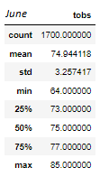
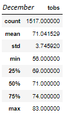
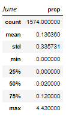
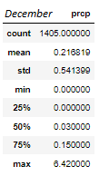

# surfs-up

## Overview of Statistical Analysis
### Overview
To investigate the potential for year-round business sustainability of an ice cream shop in Oahu based on year-round temperature data. 

## Results
### Results of temperature analysis

1. June had a higher average temperature (74.9 degrees) compared to December (71.0 degrees). 
2. June had a slightly more consistent temperature (st.dev ±3.3 degrees) compared to December (st.dev ±3.7 degrees). 
3. June had a higher max temperature (85.0 degrees) compared to December (83.0 degrees). 

## Summary
### Temperature Statistics

**June's temperature was more consistent than December's, with a slightly higher average temperature. Still, the overall 
temperature of Oahu remained relatively consistent throughout the year, with the average temperature only changing by 3.9 degrees 
between June and December.  **

   

### Additional Queries

**Between June and December, December had higher average rainfall, as well as a higher max rainfall. Still, the rainfall 
does not differ too much so as to provide a problem for the ice cream business. Even though December is rainier than June, 
the difference in rainfall would likely not prove to be a hindrance for the business. **

#### June Precipitation Statistics

#### December Precipitation Statistics

